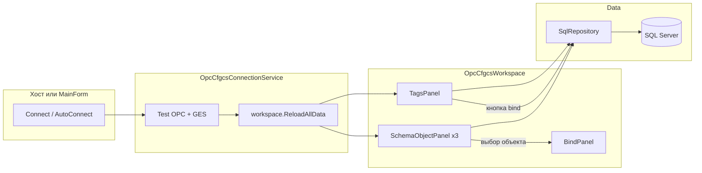

# Архитектура OPC_CFGCS

Миграция Access ADP → C# WinForms (.NET 4.8.1), SQL Server (`OPC_Config`, `GES`).

## Слои и сборки

```
┌─────────────────────────────────────────────────────────┐
│  OPC_CFGCS.exe (Program → MainForm)                     │
│  Стороннее приложение → OPC_CFGCS.Integration.dll       │
└──────────────────────────┬──────────────────────────────┘
                           │
┌──────────────────────────▼──────────────────────────────┐
│  OPC_CFGCS.Integration                                    │
│  OpcCfgcsHost, OpcCfgcsSession                            │
└──────────────────────────┬──────────────────────────────┘
                           │
┌──────────────────────────▼──────────────────────────────┐
│  OPC_CFGCS.UI                                             │
│  Forms, Controls, OpcCfgcsWorkspace, ConnectionService    │
└──────────────┬────────────────────────────┬───────────────┘
               │                            │
┌──────────────▼──────────────┐  ┌──────────▼──────────────┐
│  OPC_CFGCS.Core             │  │  OPC_CFGCS.Data         │
│  AppState, AreaHelper,      │  │  DatabaseConnection,    │
│  SchemaObjectType, DTO      │  │  SqlRepository, Models  │
└─────────────────────────────┘  └─────────────────────────┘
```

| Сборка | Зависит от | Роль |
|--------|------------|------|
| `OPC_CFGCS.Data` | — | ADO.NET, модели, `SqlRepository` |
| `OPC_CFGCS.Core` | Data | Общие типы, `AppState`, `AreaHelper` |
| `OPC_CFGCS.UI` | Core, Data | WinForms UI, рабочая область |
| `OPC_CFGCS.Integration` | UI, Core, Data | API для хост-приложений |
| `OPC_CFGCS.exe` | UI (WinExe) | Автономный запуск |

## Сценарии запуска

**Standalone:** `Program.Main` → `MainForm` (панель подключения + `OpcCfgcsWorkspace` + меню).

**Embedded:** хост → `OpcCfgcsHost.CreateSession` → `CreateWorkspace()` на панели; меню хоста → `ShowTagsEditor` / `ShowReferenceData`. См. [INTEGRATION.md](INTEGRATION.md).

## Ключевые классы UI

| Класс | Назначение |
|-------|------------|
| `MainForm` | Standalone: OPC/GES, кнопка «Подключиться», меню |
| `OpcCfgcsWorkspace` | Вкладки схемы, bind, теги, `BindPanel` |
| `SchemaObjectPanel` | Грид объектов (ПС / шина / выключатель) |
| `TagsPanel` | Грид тегов; на workspace — только просмотр и bind |
| `BindPanel` | Список тегов связанных с выбранным объектом |
| `TagsEditForm` | Полное редактирование тегов |
| `ReferenceDataForm` | CRUD справочников |
| `OpcCfgcsConnectionService` | Тест подключения + `ReloadAllData` |
| `OpcCfgcsConnectionResolver` | Строки: явные → история → App.config |
| `RecentConnectionsStore` | XML история в `%AppData%` |

## Integration API

| Класс | Назначение |
|-------|------------|
| `OpcCfgcsHost` | `CreateSession(options)` |
| `OpcCfgcsSession` | `Connect`, `CreateWorkspace`, диалоги |
| `OpcCfgcsSessionOptions` | Строки подключения, `AutoConnect` |
| `OpcCfgcsConnectResult` | `Success`, `StatusText`, `LoadErrors` |

## Core и Data

| Класс | Назначение |
|-------|------------|
| `DatabaseConnection` | Static строки OPC_Config / GES, `TestConnection` |
| `SqlRepository` | Все SQL: теги, объекты схемы, справочники, bind |
| `AppState` | `CurrentArea` — текущая подстанция (глобально на процесс) |
| `AreaHelper` | `GetParentObj(area)` — разбор Area тега |
| `SchemaObjectType` | PowerStation, CellBus, CellSwitch |
| `BindingService` | Заготовка API bind (пока не используется в UI) |

## Поток данных (конфигуратор)



1. Подключение задаёт `DatabaseConnection.ConnectionString` / `GesConnectionString`.
2. `ReloadAllData` загружает объекты схемы и теги через панели → `SqlRepository`.
3. Выбор объекта слева обновляет `BindPanel` и выделяет связанный тег.
4. Кнопка `<=>` / `<X>` меняет `Tags.ObjectId` в БД.

## Зависимости контролов

`OpcCfgcsWorkspace` создаёт в runtime (не в дизайнере):

- `SchemaObjectPanel(PowerStation | CellBus | CellSwitch)` на вкладках
- `TagsPanel(editable: false)` в правой колонке

Каждая панель держит свой `SqlRepository` (отдельные экземпляры).

## Файлы по проектам

```
src/OPC_CFGCS.Data/     DatabaseConnection.cs, SqlRepository.cs, Models/*
src/OPC_CFGCS.Core/     AppState, AreaHelper, SchemaObjectType, OpcCfgcs* DTO
src/OPC_CFGCS.UI/       Forms/, Controls/, OpcCfgcsConnection*.cs, Program.cs
src/OPC_CFGCS.Integration/  OpcCfgcsHost.cs, OpcCfgcsSession.cs
```

## Соответствие ADP

| ADP | WinForms |
|-----|----------|
| frm_Main | MainForm + OpcCfgcsWorkspace |
| frm_Tags | TagsEditForm, TagsPanel |
| frm_Ps / Bus / Switch | SchemaObjectPanel |
| frm_Bind | BindPanel |
| Module1.gCurrArea | AppState.CurrentArea |

## Ссылки

[README.md](../README.md) · [INTEGRATION.md](INTEGRATION.md) · `src/OPC_CFGCS.Integration` · `src/OPC_CFGCS.UI/Controls/OpcCfgcsWorkspace.cs`
